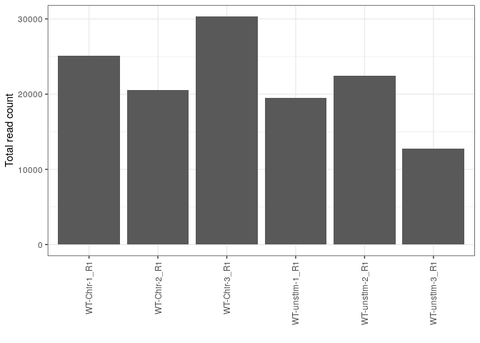
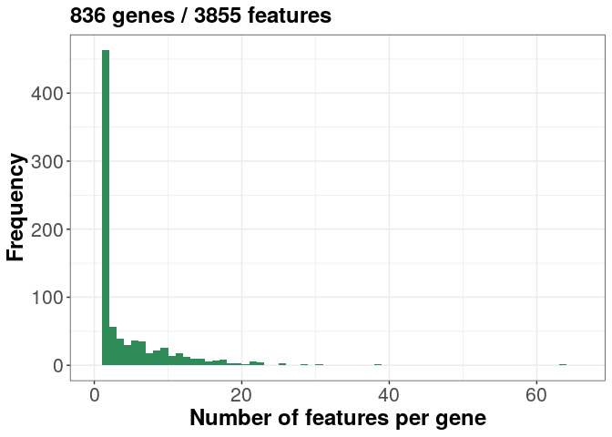
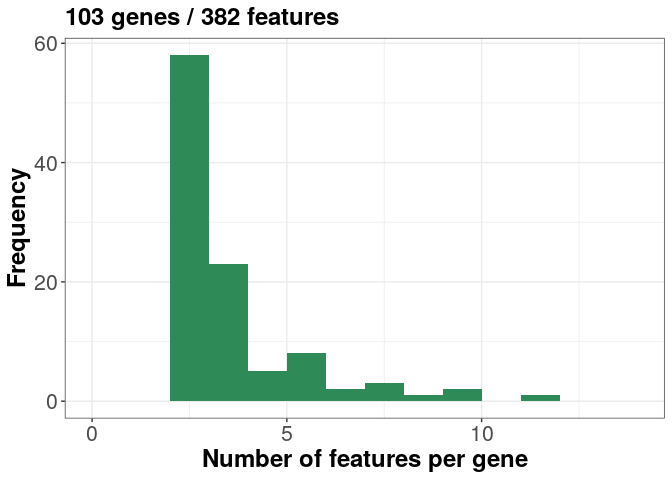
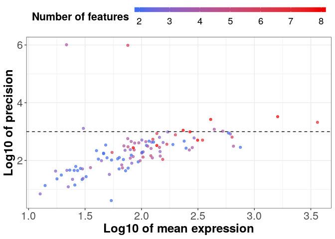
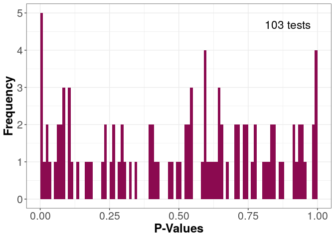
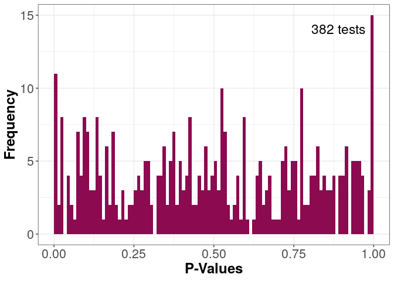

# Introduction

This script performs differential transcript usage analysis with DRIMSeq
[@Nowicka2016DRIMSeq], based on abundance estimates from Salmon. It supports
testing one or more contrasts. For more detailed information of every step, 
we refer to the [DRIMSeq vignette](http://bioconductor.org/packages/release/bioc/vignettes/DRIMSeq/inst/doc/DRIMSeq.pdf).

# Load packages


```r
suppressPackageStartupMessages({
    library(dplyr)
    library(tximport)
    library(tximeta)
    library(SingleCellExperiment)
    library(edgeR)
    library(DRIMSeq)
    library(ggplot2)
})
```

# Load `SummarizedExperiment` object

We load the `SummarizedExperiment` objects prepared using `tximeta`, containing
gene- and transcript-level counts and feature lengths. In this report, we will
use the transcript-level quantifications.


```r
sg <- se$sg
st <- se$st
st
```

```
## class: SingleCellExperiment 
## dim: 3855 6 
## metadata(5): tximetaInfo quantInfo countsFromAbundance txomeInfo
##   txdbInfo
## assays(3): counts abundance length
## rownames(3855): ENST00000402588 ENST00000634759 ...
##   ENST00000439655 ENST00000616792
## rowData names(11): tx_id tx_biotype ... seq_coord_system symbol
## colnames(6): WT-Chir-1_R1 WT-Chir-2_R1 ... WT-unstim-2_R1
##   WT-unstim-3_R1
## colData names(3): names type condition
## reducedDimNames(0):
## spikeNames(0):
```

# Plot total number of reads per sample


```r
ggplot(data.frame(totCount = colSums(assay(sg, "counts")), 
                  sample = colnames(assay(sg, "counts")), 
                  stringsAsFactors = FALSE), 
       aes(x = sample, y = totCount)) + geom_bar(stat = "identity") + 
    theme_bw() + xlab("") + ylab("Total read count") + 
    theme(axis.text.x = element_text(angle = 90, hjust = 1, vjust = 0.5))
```

<!-- -->

# Create dmDSdata object

To create a `dmDSdata` object, which is the container used by `DRIMSeq` to store
feature counts and metadata, we need a `data.frame` containing information about
the samples (`metadata`) and a `data.frame` with counts (`counts`). The
`dmDSdata` object is used to create a data summary plot.


```r
print(contrast)
```

```
## [1] "conditionWT__chir-conditionWT__unstim"
```

```r
print(design)
```

```
## [1] "~0+condition"
```

```r
counts <- data.frame(feature_id = rownames(st),
                     gene_id = unlist(rowData(st)$gene_id),
                     assay(st, "counts"),
                     row.names = NULL,
                     check.names = FALSE)

metadata <- data.frame(colData(st))
metadata <- metadata %>% 
    dplyr::rename(sample_id = names)

d <- dmDSdata(counts = counts, samples = metadata)
plotData(d)
```

<!-- -->

# Filter 

The genes with low expression levels are filtered out to ensure that the
observed transcript ratios are reliable. A single gene may have many
transcripts, and lowly expressed individual transcripts are removed using
`min_samps_feature_expr`.


```r
d <- dmFilter(d, min_samps_gene_expr = 3, min_samps_feature_expr = 3,
              min_gene_expr = 10, min_feature_expr = 5)
plotData(d)
```

<!-- -->

# Define design.

Here, we specify the design matrix used for the Dirichlet-multinomial model in the later step.


```r
print(samples(d))
```

```
##                     sample_id type  condition
## WT-Chir-1_R1     WT-Chir-1_R1   SE   WT__chir
## WT-Chir-2_R1     WT-Chir-2_R1   SE   WT__chir
## WT-Chir-3_R1     WT-Chir-3_R1   SE   WT__chir
## WT-unstim-1_R1 WT-unstim-1_R1   SE WT__unstim
## WT-unstim-2_R1 WT-unstim-2_R1   SE WT__unstim
## WT-unstim-3_R1 WT-unstim-3_R1   SE WT__unstim
```

```r
(des <- model.matrix(as.formula(design), data = samples(d)))
```

```
##                conditionWT__chir conditionWT__unstim
## WT-Chir-1_R1                   1                   0
## WT-Chir-2_R1                   1                   0
## WT-Chir-3_R1                   1                   0
## WT-unstim-1_R1                 0                   1
## WT-unstim-2_R1                 0                   1
## WT-unstim-3_R1                 0                   1
## attr(,"assign")
## [1] 1 1
## attr(,"contrasts")
## attr(,"contrasts")$condition
## [1] "contr.treatment"
```

# Calculate precision

Computationally, it is more convenient to first estimate the precision before
you fit a Dirichlet-multinomial model to the data. The precision parameters are
estimated using the Cox-Reid adjusted profile likelihood. By default, $10\%$ of
the genes (randomly selected) are used to estimate the initial value (the common
precision). To get reproducible results, a random seed is used.

To inspect the behavior of the precision estimates, they are plotted against the
mean gene expression. Typically, precision increases for genes with higher mean
expression in RNA-seq data.


```r
set.seed(123)
if(ncores > 1) {
  bpps <- BiocParallel::MulticoreParam(min(parallel::detectCores(),ncores))
} else {
  bpps <- BiocParallel::SerialParam()
}

d <- dmPrecision(d, design = des, add_uniform = TRUE, BPPARAM = bpps)
```

```
## ! Using a subset of 0.1 genes to estimate common precision !
```

```
## ! Using common_precision = 994.8884 as prec_init !
```

```
## ! Using 0.825367 as a shrinkage factor !
```

```r
plotPrecision(d)
```

<!-- -->

# Fit model

At the gene level, the maximum likelihood is used to estimate the coefficients
of the Dirichlet-multinomial (DM) regression and the fitted transcript
proportions in each sample. At the transcript level, beta-binomial regression is
applied to each transcript separately.


```r
d <- dmFit(d, design = des, verbose = 1, add_uniform = TRUE)
```

```
## * Fitting the DM model..
```

```
##    Using the one way approach.
```

```
## Took 0.6446 seconds.
```

```
## * Fitting the BB model..
```

```
##    Using the one way approach.
```

```
## Took 0.2925 seconds.
```

# Define contrasts.

The contrasts are defined to do comparisons between specified groups.


```r
print(contrast)
```

```
## [1] "conditionWT__chir-conditionWT__unstim"
```

```r
(contrasts <- as.data.frame(makeContrasts(contrasts = contrast, levels = des)))
```

```
##                     conditionWT__chir-conditionWT__unstim
## conditionWT__chir                                       1
## conditionWT__unstim                                    -1
```

# Perform tests

The test can be performed on the gene level (`level <- 'gene'`) or the
transcript level (`level <- 'feature'`) using the likelihood ratio test. The
results are stored as `DRIMSeq_res` and `DRIMSeq_feature_res` for the gene and
the transcript level, respectively.


```r
level <- "gene" 
signif3 <- function(x) signif(x, digits = 3)
DRIMSeq_fits <- lapply(contrasts, function(cm) {
    dr <- dmTest(d, contrast = cm, verbose = 1)
    print(plotPValues(dr, level = level))
    dr
})
```

```
## * Fitting the DM model..
```

```
##    Using the regression approach.
```

```
## Took 1.002 seconds.
```

```
## * Calculating likelihood ratio statistics..
```

```
## Took 6e-04 seconds.
```

```
## * Fitting the BB model..
```

```
##    Using the regression approach.
```

```
## Took 0.2006 seconds.
```

```
## * Calculating likelihood ratio statistics..
```

```
## Took 4e-04 seconds.
```

<!-- -->

```r
DRIMSeq_res <- lapply(DRIMSeq_fits, function(dr) {
    results(dr, level = level) %>%
        dplyr::mutate(mlog10PValue = -log10(pvalue)) %>% 
        dplyr::mutate_if(is.numeric, signif3)
})
```


```r
level <- "feature" 
DRIMSeq_feature_fits <- lapply(contrasts, function(cm) {
    dr <- dmTest(d, contrast = cm, verbose = 1)
    print(plotPValues(dr, level = level))
    dr
})
```

```
## * Fitting the DM model..
```

```
##    Using the regression approach.
```

```
## Took 0.8332 seconds.
```

```
## * Calculating likelihood ratio statistics..
```

```
## Took 3e-04 seconds.
```

```
## * Fitting the BB model..
```

```
##    Using the regression approach.
```

```
## Took 0.1853 seconds.
```

```
## * Calculating likelihood ratio statistics..
```

```
## Took 4e-04 seconds.
```

<!-- -->

```r
DRIMSeq_feature_res <- lapply(DRIMSeq_feature_fits, function(dr) {
    results(dr, level = level) %>%
        dplyr::mutate(mlog10PValue = -log10(pvalue)) %>% 
        dplyr::mutate_if(is.numeric, signif3)
})
```

# Write results to text files

The gene-level results are exported to text files.


```r
if (class(DRIMSeq_res) == "data.frame") {
    write.table(DRIMSeq_res %>% dplyr::arrange(pvalue), 
                file = "DRIMSeq_dtu_results.txt", 
                sep = "\t", row.names = FALSE, col.names = TRUE, quote = FALSE)
} else {
    for (nm in names(DRIMSeq_res)) {
        write.table(DRIMSeq_res[[nm]] %>% dplyr::arrange(pvalue), 
                    file = paste0("DRIMSeq_dtu_results_", nm, ".txt"), 
                    sep = "\t", row.names = FALSE, col.names = TRUE, quote = FALSE)
    }
}
```

# Output results as `SingleCellExperiment` object

Here, we store the results on the gene level together with the original data.
The result table `DRIMSeq_res` is appended to the `rowData` of the original
gene-level `SummarizedExperiment` object `sg`. For genes that were filtered out,
`NA` values are used in the results. The updated `sg` can be fed to the R
package `iSEE` to perform more exploratory and visual analysis.


```r
## add rows (NA) for genes that are filtered out (if any)
DRIMSeq_resA <- lapply(seq_along(DRIMSeq_res), FUN = function(x) {
    
    # all genes
    geneA <- rowData(sg)$gene_id
    
    # genes that are not filtered out
    resX <- DRIMSeq_res[[x]]
    
    # other characteristics that have been calculated
    mexp <- mean_expression(DRIMSeq_fits[[x]]) %>%
        dplyr::arrange(match(gene_id, resX$gene_id)) %>%
        dplyr::select(-gene_id) 
    prec <- genewise_precision(DRIMSeq_fits[[x]]) %>%  
        dplyr::arrange(match(gene_id, resX$gene_id)) %>%
        dplyr::select(-gene_id) 
   
    resX <- resX %>%
        dplyr::bind_cols(mexp) %>%
        dplyr::bind_cols(prec) %>%
        dplyr::mutate(contrast = names(DRIMSeq_res)[[x]]) 
    resX$common_precision <- common_precision(DRIMSeq_fits[[x]])
    rownames(resX) <- resX$gene_id
    
    # genes that are filtered out 
    geneO <- setdiff(geneA, resX$gene_id)
    
    # results for all genes
    if (length(geneO) > 0) {
        # create a data frame with values NA as the results of the genes that
        # are filtered out
        matO <- matrix(NA, nrow = length(geneO),
                        ncol = ncol(resX),
                        dimnames = list(geneO, 
                                        colnames(resX))) 
        resO <- data.frame(matO)
        resO$gene_id <- geneO
        
        # combine the result tables 
        resA <- resO %>%
            dplyr::bind_rows(resX) %>%
            dplyr::arrange(match(gene_id, geneA)) %>%
            dplyr::mutate(contrast = names(DRIMSeq_res)[[x]]) 
            
    } else {
        resA <- resX %>%
            dplyr::arrange(match(gene_id, geneA)) %>%
            dplyr::mutate(contrast = names(DRIMSeq_res)[[x]]) 
    }
    
    # round numeric columns to 3 significant digits
    resA <- resA  %>% 
        dplyr::mutate_if(is.numeric, signif3)

    # use gene column as rownames
    rownames(resA) <- resA$gene_id
    
    # convert to DataFrame
    resA <- S4Vectors::DataFrame(resA)
    return(resA)
})
names(DRIMSeq_resA) <- names(DRIMSeq_res)

## Put the result tables in rowData 
for (i in seq_along(DRIMSeq_resA)) {
    nam <- names(DRIMSeq_resA)[i]
    namI <- paste("DRIMSeq:", nam, sep = "")
    stopifnot(all(rowData(sg)$gene_id == rownames(DRIMSeq_resA[[i]])))
    rowData(sg)[[namI]] <- DRIMSeq_resA[[i]] 
}
```

Here, we store the results on the transcript-level together with the original
data. The result table `DRIMSeq_feature_res` is appended to the `rowData` of the
original transcript-level `SummarizedExperiment` object `st`. For transcripts
that were filtered out, `NA` values are used in the results. The updated `st`
can be fed to the R package `iSEE` to perform more exploratory and visual
analysis.


```r
## add rows (NA) for genes that are filtered out (if any)
DRIMSeq_resB <- lapply(seq_along(DRIMSeq_feature_res), FUN = function(x) {
    
    # all genes
    txA <- rowData(st)$tx_id
    
    # genes that are not filtered out
    resX <- DRIMSeq_feature_res[[x]]
    
    prop <- proportions(DRIMSeq_feature_fits[[x]]) %>%  
        dplyr::arrange(match(feature_id, resX$feature_id)) %>%
        dplyr::select(-c(gene_id, feature_id))
    colnames(prop) <- paste("proportion", colnames(prop), sep = "_")
    
    coef <- coefficients(DRIMSeq_feature_fits[[x]]) %>%  
        dplyr::arrange(match(feature_id, resX$feature_id)) %>%
        dplyr::select(-c(gene_id, feature_id))
    colnames(coef) <- paste("coef", colnames(coef), sep = "_")
    
    resX <- resX %>%
        dplyr::bind_cols(prop) %>%
        dplyr::bind_cols(coef) %>%
        dplyr::mutate(contrast = names(DRIMSeq_res)[[x]]) 
    
    rownames(resX) <- resX$feature_id
    
    # genes that are filtered out 
    txO <- setdiff(txA, resX$feature_id)
    
    # results for all genes
    if (length(txO) > 0) {
        # create a data frame with values NA as the results of the genes that
        # are filtered out
        matO <- matrix(NA, nrow = length(txO),
                        ncol = ncol(resX),
                        dimnames = list(txO, 
                                        colnames(resX))) 
        resO <- data.frame(matO)
        resO$feature_id <- txO
        
        # combine the result tables 
        resA <- resO %>%
            dplyr::bind_rows(resX) %>%
            dplyr::arrange(match(feature_id, txA)) %>%
            dplyr::mutate(contrast = names(DRIMSeq_feature_res)[[x]]) 
            
    } else {
        resA <- resX %>%
            dplyr::arrange(match(feature_id, txA)) %>%
            dplyr::mutate(contrast = names(DRIMSeq_feature_res)[[x]]) 
    }
    
    # round numeric columns to 3 significant digits
    resA <- resA  %>% 
        dplyr::mutate_if(is.numeric, signif3)

    # use gene column as rownames
    rownames(resA) <- resA$feature_id
    
    # convert to DataFrame
    resA <- S4Vectors::DataFrame(resA)
    return(resA)
})
names(DRIMSeq_resB) <- names(DRIMSeq_feature_res)

## Put the result tables in rowData 
for (i in seq_along(DRIMSeq_resB)) {
    nam <- names(DRIMSeq_resB)[i]
    namI <- paste("DRIMSeq:", nam, sep = "")
    stopifnot(all(rowData(st)$tx_id == rownames(DRIMSeq_resB[[i]])))
    rowData(st)[[namI]] <- DRIMSeq_resB[[i]] 
}
```

The output is saved as a list.


```r
analysis_se <- list(sg = sg, st = st)
saveRDS(analysis_se, file = "DRIMSeq_dtu.rds")
```

# Session info

The analyses above were performed with the following package versions:


```r
sessionInfo()
```

```
## R version 3.6.0 (2019-04-26)
## Platform: x86_64-pc-linux-gnu (64-bit)
## Running under: Debian GNU/Linux 9 (stretch)
## 
## Matrix products: default
## BLAS/LAPACK: /usr/lib/libopenblasp-r0.2.19.so
## 
## locale:
##  [1] LC_CTYPE=en_US.UTF-8       LC_NUMERIC=C              
##  [3] LC_TIME=en_US.UTF-8        LC_COLLATE=en_US.UTF-8    
##  [5] LC_MONETARY=en_US.UTF-8    LC_MESSAGES=C             
##  [7] LC_PAPER=en_US.UTF-8       LC_NAME=C                 
##  [9] LC_ADDRESS=C               LC_TELEPHONE=C            
## [11] LC_MEASUREMENT=en_US.UTF-8 LC_IDENTIFICATION=C       
## 
## attached base packages:
## [1] parallel  stats4    stats     graphics  grDevices utils     datasets 
## [8] methods   base     
## 
## other attached packages:
##  [1] ggplot2_3.2.1               DRIMSeq_1.12.0             
##  [3] edgeR_3.26.8                limma_3.40.6               
##  [5] SingleCellExperiment_1.6.0  SummarizedExperiment_1.14.1
##  [7] DelayedArray_0.10.0         BiocParallel_1.18.1        
##  [9] matrixStats_0.55.0          Biobase_2.44.0             
## [11] GenomicRanges_1.36.1        GenomeInfoDb_1.20.0        
## [13] IRanges_2.18.3              S4Vectors_0.22.1           
## [15] BiocGenerics_0.30.0         tximeta_1.2.2              
## [17] tximport_1.12.3             dplyr_0.8.3                
## [19] rmarkdown_1.16              BiocManager_1.30.9         
## 
## loaded via a namespace (and not attached):
##  [1] httr_1.4.1               bit64_0.9-7             
##  [3] jsonlite_1.6             assertthat_0.2.1        
##  [5] BiocFileCache_1.8.0      blob_1.2.0              
##  [7] GenomeInfoDbData_1.2.1   Rsamtools_2.0.3         
##  [9] yaml_2.2.0               progress_1.2.2          
## [11] pillar_1.4.2             RSQLite_2.1.2           
## [13] backports_1.1.5          lattice_0.20-38         
## [15] glue_1.3.1               digest_0.6.22           
## [17] XVector_0.24.0           colorspace_1.4-1        
## [19] plyr_1.8.4               htmltools_0.4.0         
## [21] Matrix_1.2-17            XML_3.98-1.20           
## [23] pkgconfig_2.0.3          biomaRt_2.40.5          
## [25] zlibbioc_1.30.0          purrr_0.3.3             
## [27] scales_1.0.0             tibble_2.1.3            
## [29] AnnotationFilter_1.8.0   withr_2.1.2             
## [31] GenomicFeatures_1.36.4   lazyeval_0.2.2          
## [33] magrittr_1.5             crayon_1.3.4            
## [35] memoise_1.1.0            evaluate_0.14           
## [37] MASS_7.3-51.4            tools_3.6.0             
## [39] prettyunits_1.0.2        hms_0.5.2               
## [41] stringr_1.4.0            munsell_0.5.0           
## [43] locfit_1.5-9.1           AnnotationDbi_1.46.1    
## [45] ensembldb_2.8.1          Biostrings_2.52.0       
## [47] compiler_3.6.0           rlang_0.4.1             
## [49] grid_3.6.0               RCurl_1.95-4.12         
## [51] rappdirs_0.3.1           labeling_0.3            
## [53] bitops_1.0-6             gtable_0.3.0            
## [55] DBI_1.0.0                curl_4.2                
## [57] reshape2_1.4.3           R6_2.4.0                
## [59] GenomicAlignments_1.20.1 knitr_1.25              
## [61] rtracklayer_1.44.4       bit_1.1-14              
## [63] zeallot_0.1.0            ProtGenerics_1.16.0     
## [65] stringi_1.4.3            Rcpp_1.0.2              
## [67] vctrs_0.2.0              dbplyr_1.4.2            
## [69] tidyselect_0.2.5         xfun_0.10
```

```r
date()
```

```
## [1] "Mon Nov 11 11:29:01 2019"
```

# References
