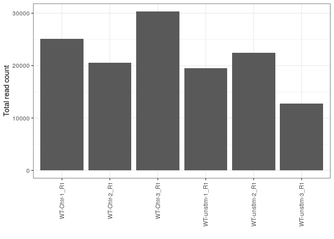
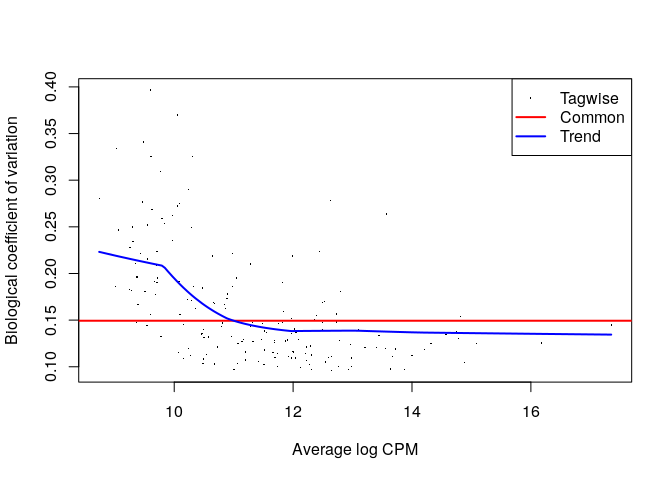
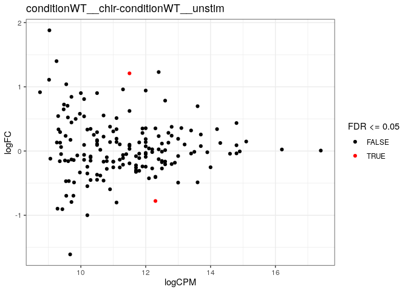

# Introduction

Here, we perform differential gene expression analysis with edgeR 
[@Robinson2010edgeR] followed by gene set analysis with camera [@Wu2012camera],
based on abundance estimates from Salmon. For more detailed information of each
step, please refer to the 
[edgeR user guide](https://www.bioconductor.org/packages/release/bioc/vignettes/edgeR/inst/doc/edgeRUsersGuide.pdf).

# Load packages


```r
suppressPackageStartupMessages({
    library(dplyr)
    library(tximport)
    library(tximeta)
    library(SingleCellExperiment)
    library(edgeR)
    library(ggplot2)
    library(msigdbr)
})
```

# Load `SummarizedExperiment` object

We load the `SummarizedExperiment` objects prepared using `tximeta`, containing
gene- and transcript-level counts and feature lengths. In this report, we will
use the gene-level quantifications.


```r
## List of SummarizedExperiment objects (gene/transcript level)
se
```

```
## $st
## class: SingleCellExperiment 
## dim: 3855 6 
## metadata(5): tximetaInfo quantInfo countsFromAbundance txomeInfo
##   txdbInfo
## assays(3): counts abundance length
## rownames(3855): ENST00000402588 ENST00000634759 ...
##   ENST00000439655 ENST00000616792
## rowData names(11): tx_id tx_biotype ... seq_coord_system symbol
## colnames(6): WT-Chir-1_R1 WT-Chir-2_R1 ... WT-unstim-2_R1
##   WT-unstim-3_R1
## colData names(3): names type condition
## reducedDimNames(0):
## spikeNames(0):
## 
## $sg
## class: SingleCellExperiment 
## dim: 836 6 
## metadata(5): tximetaInfo quantInfo countsFromAbundance txomeInfo
##   txdbInfo
## assays(3): counts abundance length
## rownames(836): ENSG00000008735__MAPK8IP2 ENSG00000015475__BID ...
##   ENSG00000288153__AC003072.2 ENSG00000288262__CT867976.1
## rowData names(6): gene_id gene_name ... seq_coord_system symbol
## colnames(6): WT-Chir-1_R1 WT-Chir-2_R1 ... WT-unstim-2_R1
##   WT-unstim-3_R1
## colData names(3): names type condition
## reducedDimNames(0):
## spikeNames(0):
```

```r
## Get gene-level SummarizedExperiment object
sg <- se$sg
metadata <- colData(sg)

sg
```

```
## class: SingleCellExperiment 
## dim: 836 6 
## metadata(5): tximetaInfo quantInfo countsFromAbundance txomeInfo
##   txdbInfo
## assays(3): counts abundance length
## rownames(836): ENSG00000008735__MAPK8IP2 ENSG00000015475__BID ...
##   ENSG00000288153__AC003072.2 ENSG00000288262__CT867976.1
## rowData names(6): gene_id gene_name ... seq_coord_system symbol
## colnames(6): WT-Chir-1_R1 WT-Chir-2_R1 ... WT-unstim-2_R1
##   WT-unstim-3_R1
## colData names(3): names type condition
## reducedDimNames(0):
## spikeNames(0):
```

# Plot total number of reads per sample


```r
ggplot(data.frame(totCount = colSums(assay(sg, "counts")), 
                  sample = colnames(assay(sg, "counts")), 
                  stringsAsFactors = FALSE), 
       aes(x = sample, y = totCount)) + geom_bar(stat = "identity") + 
    theme_bw() + xlab("") + ylab("Total read count") + 
    theme(axis.text.x = element_text(angle = 90, hjust = 1, vjust = 0.5))
```

<!-- -->

# Create DGEList and include average transcript length offsets

A `DGEList` is the main object `edgeR` requires to perform the DGE analysis. It
is designed to store read counts and associated information. After creating this
object, we add offsets, which are average transcript length correction terms 
[@Soneson2016tximport],
and scale them so they are consistent with library sizes (sequencing depth for
each sample).

Then we calculate normalization factors to scale the raw library sizes and
minimize the log-fold changes between the samples for most genes. Here the
trimmed mean of M-values between each pair of samples (TMM) is used by default
[@Robinson2010TMM].

Finally we add gene annotation information.


```r
## Extract count matrix and average transcript lengths
cts <- assay(sg, "counts")
normMat <- assay(sg, "length")
normMat <- normMat/exp(rowMeans(log(normMat)))
normCts <- cts/normMat

## Generate offset matrix
eff.lib <- edgeR::calcNormFactors(normCts) * colSums(normCts)
normMat <- sweep(normMat, 2, eff.lib, "*")
normMat <- log(normMat)

## Create DGEList object and add offsets
dge0 <- edgeR::DGEList(cts)
dge0 <- edgeR::scaleOffset(dge0, normMat)
dge0 <- edgeR::calcNormFactors(dge0)

dge0$genes <- as.data.frame(rowRanges(sg))
```

# Calculate logCPMs and add as an assay

We calculate log-counts per million (CPMs) because they are useful descriptive
measures for the expression level of a gene. Note, however, that the normalized
values are not used for the differential expression analysis. By default, the
normalized library sizes are used in the computation.

We add the logCPMs to one of the fields (or assay) of the first gene-level
`SummarizedExperiment` object `sg`. At the end of the analysis, we will use this
object again to export the results of all the genes we started with.


```r
# Here we use the approach from csaw::calculateCPM(), in order to account for
# the average transcript length offsets in the CPM calculations
off.mat <- dge0$offset
new.offset <- edgeR::scaleOffset(dge0$samples$lib.size, off.mat)

ap <- edgeR::addPriorCount(dge0$counts, offset = new.offset, prior.count = 2)
logcpms <- log2(ap$y) - as.matrix(ap$offset)/log(2) + log2(1e6)
dimnames(logcpms) <- dimnames(dge0$counts)

stopifnot(all(rownames(logcpms) == rownames(sg)),
          all(colnames(logcpms) == colnames(sg)))
assay(sg, "logcpm") <- logcpms
```

# Define design. 

Next, we specify the design matrix of the experiment, defining which sample 
annotations will be taken into account in the statistical modeling.


```r
stopifnot(all(colnames(dge0) == metadata$names))

print(metadata)
```

```
## DataFrame with 6 rows and 3 columns
##                         names        type   condition
##                   <character> <character> <character>
## WT-Chir-1_R1     WT-Chir-1_R1          SE    WT__chir
## WT-Chir-2_R1     WT-Chir-2_R1          SE    WT__chir
## WT-Chir-3_R1     WT-Chir-3_R1          SE    WT__chir
## WT-unstim-1_R1 WT-unstim-1_R1          SE  WT__unstim
## WT-unstim-2_R1 WT-unstim-2_R1          SE  WT__unstim
## WT-unstim-3_R1 WT-unstim-3_R1          SE  WT__unstim
```

```r
print(design)
```

```
## [1] "~0+condition"
```

```r
(des <- model.matrix(as.formula(design), data = metadata))
```

```
##                conditionWT__chir conditionWT__unstim
## WT-Chir-1_R1                   1                   0
## WT-Chir-2_R1                   1                   0
## WT-Chir-3_R1                   1                   0
## WT-unstim-1_R1                 0                   1
## WT-unstim-2_R1                 0                   1
## WT-unstim-3_R1                 0                   1
## attr(,"assign")
## [1] 1 1
## attr(,"contrasts")
## attr(,"contrasts")$condition
## [1] "contr.treatment"
```

# Filter out lowly expressed genes

Next we determine which genes have sufficiently large counts to be retained in
the statistical analysis, and remove the rest. After removing genes, we 
recalculate the normalization factors.


```r
dim(dge0)
```

```
## [1] 836   6
```

```r
keep <- edgeR::filterByExpr(dge0, design = des)
dge <- dge0[keep, ]
dge <- calcNormFactors(dge)
dim(dge)
```

```
## [1] 173   6
```

# Estimate dispersion and fit QL model

We model the count data using a quasi-likelihood (QL) negative binomial (NB)
generalized log-linear model, which accounts for gene-specific variability from
both biological and technical sources. Before fitting the model, we estimate
the NB dispersion (overall biological variability across all genes), and the QL
dispersion (gene-specific) using the `estimateDisp()` function.

It is also good practice to look at the relationship between the biological
coefficient of variation (NB dispersion) and the gene abundance (in logCPMs).


```r
## Estimate dispersion and fit model
dge <- estimateDisp(dge, design = des)
qlfit <- glmQLFit(dge, design = des)

## Plot dispersions
plotBCV(dge)
```

<!-- -->

# Define contrasts 

Before testing for differences in gene expression, we define the contrasts
we wish to test for. Here we represent the constrasts as a numeric matrix:


```r
print(contrast)
```

```
## [1] "conditionWT__chir-conditionWT__unstim"
```

```r
(contrasts <- as.data.frame(makeContrasts(contrasts = contrast, levels = des)))
```

```
##                     conditionWT__chir-conditionWT__unstim
## conditionWT__chir                                       1
## conditionWT__unstim                                    -1
```

# Perform DGE tests

Now we perform genewise tests for every contrast defined above, and save the
results for every contrast.


```r
signif3 <- function(x) signif(x, digits = 3)
edgeR_res <- lapply(contrasts, function(cm) {
    qlf <- glmQLFTest(qlfit, contrast = cm)
    tt <- topTags(qlf, n = Inf, sort.by = "none")$table
    tt %>%
        dplyr::mutate(mlog10PValue = -log10(PValue)) %>% 
        dplyr::mutate_if(is.numeric, signif3)
})
```

# Make MA plots

We can visualize the test results by plotting the logCPM (average) vs the logFC,
and coloring genes with an adjusted p-value below 0.05 (or another specificed
FDR threshold). A plot is drawn for every contrast.


```r
if (is(edgeR_res, "data.frame")) {
    print(ggplot(edgeR_res, aes(x = logCPM, y = logFC, color = FDR <= 0.05)) + 
              geom_point() + theme_bw() + 
              scale_color_manual(values = c("TRUE" = "red", "FALSE" = "black")))
} else {
    for (nm in names(edgeR_res)) {
        print(ggplot(edgeR_res[[nm]], aes(x = logCPM, y = logFC, color = FDR <= 0.05)) + 
                  geom_point() + theme_bw() + 
                  scale_color_manual(values = c("TRUE" = "red", "FALSE" = "black")) + 
                  ggtitle(nm))
    }
}
```

<!-- -->

# Write DGE results to text files

We export the results into text files that can be opened using any text editor.


```r
## Write results to text files and make MA plots
if (is(edgeR_res, "data.frame")) {
    write.table(edgeR_res %>% dplyr::arrange(PValue), 
                file = "edgeR_dge_results.txt", 
                sep = "\t", row.names = FALSE, col.names = TRUE, quote = FALSE)
} else {
    for (nm in names(edgeR_res)) {
        write.table(edgeR_res[[nm]] %>% dplyr::arrange(PValue), 
                    file = paste0("edgeR_dge_results_", nm, ".txt"), 
                    sep = "\t", row.names = FALSE, col.names = TRUE, quote = FALSE)
    }
}
```

# Output DGE results as list of `SingleCellExperiment` objects

Here, we store the analysis results with the original data. The results are
appended on the `rowData` of the original gene-level `SummarizedExperiment`
object `sg`. For genes that were filtered out, `NA` values are used in the
result columns. The updated `sg` could be fed to the R package `iSEE` to
perform more exploratory and visual analysis.


```r
## add rows (NA) for genes that are filtered out (if any)
edgeR_resA <- lapply(seq_along(edgeR_res), FUN = function(x) {
    
    ## All genes
    geneA <- rowData(sg)$gene_id
    
    ## Genes that are not filtered out
    resX <- edgeR_res[[x]]
    resX <- resX %>% 
        dplyr::select(c("gene_id", "gene_name", "logFC", "logCPM", 
                        "F", "FDR", "PValue", "mlog10PValue")) 
    rownames(resX) <- resX$gene_id
    
    ## Genes that are filtered out 
    geneO <- setdiff(geneA, resX$gene_id)
    
    ## results for all genes
    if (length(geneO) > 0) {
        ## create a data frame with values NA as the results of the genes that
        ## are filtered out
        matO <- matrix(NA, nrow = length(geneO),
                       ncol = ncol(resX),
                       dimnames = list(geneO, 
                                       colnames(resX))) 
        resO <- data.frame(matO)
        resO$gene_id <- geneO
        resO$gene_name <- rowData(sg)$gene_name[match(geneO, rowData(sg)$gene_id)]
        
        ## Combine the result tables 
        resA <- resO %>%
            dplyr::bind_rows(resX) %>%
            dplyr::arrange(match(gene_id, geneA)) %>%
            dplyr::mutate(contrast = names(edgeR_res)[[x]]) 
    } else {
        resA <- resX %>%
            dplyr::arrange(match(gene_id, geneA)) %>%
            dplyr::mutate(contrast = names(edgeR_res)[[x]]) 
    }
    
    ## Use gene column as rownames
    rownames(resA) <- paste(resA$gene_id, resA$gene_name, sep = "__")
    
    ## convert to DataFrame
    resA <- S4Vectors::DataFrame(resA)
    return(resA)
})
names(edgeR_resA) <- names(edgeR_res)

## Put the result tables in rowData 
for (i in seq_along(edgeR_resA)) {
    nam <- names(edgeR_resA)[i]
    namI <- paste("edgeR:", nam, sep = "")
    stopifnot(all(rownames(sg) == rownames(edgeR_resA[[i]])))
    rowData(sg)[[namI]] <- edgeR_resA[[i]] 
}
```

The output is saved as a list. Compared to the input data `se`, the element `sg`
is updated and `st` stays the same.


```r
analysis_se <- list(sg = sg, st = se$st)
saveRDS(analysis_se, file = "edgeR_dge.rds")
```


# Load gene sets 

We will use `camera` to perform an enrichment analysis for a collection of 
gene sets from the [mSigDB](http://software.broadinstitute.org/gsea/msigdb), 
packaged in the `msigdbr` R package. Here, we load the gene set definitions 
and select which ones to include in the analysis.


```r
## Retrieve gene sets and combine in a tibble
m_df <- bind_rows(lapply(genesets, 
                         function(x) msigdbr(species = organism, category = x)))
```

# Perform tests

Next, we perform the gene set analysis. We consider only gene sets where the 
number of genes shared with the data set is not too small and not too large. 
`camera` is a competitive gene set test that accounts for correlations among 
the genes within a gene set.


```r
minSize <- 3
maxSize <- 500

## Get index for genes in each gene set in the DGEList
indexList <- limma::ids2indices(
    gene.sets = lapply(split(m_df, f = m_df$gs_name), function(w) w$gene_symbol),
    identifiers = dge$genes$gene_name,
    remove.empty = TRUE
)

## Filter out too small or too large gene sets
gsSizes <- vapply(indexList, length, 0)
indexList <- indexList[gsSizes >= minSize & gsSizes <= maxSize]
```


```r
camera_res <- lapply(contrasts, function(cm) {
    camera(dge, index = indexList, design = des, contrast = cm, 
           inter.gene.cor = NA)
})
```


# Write gene set analysis results to text files

The results from `camera` are written to a separate text file for each tested 
contrast.


```r
## Write results to text files
if (is(camera_res, "data.frame")) {
    write.table(camera_res %>% tibble::rownames_to_column("GeneSet") %>%
                    dplyr::arrange(PValue), 
                file = "camera_dge_results.txt", 
                sep = "\t", row.names = FALSE, col.names = TRUE, quote = FALSE)
} else {
    for (nm in names(camera_res)) {
        write.table(camera_res[[nm]] %>% 
                        tibble::rownames_to_column("GeneSet") %>%
                        dplyr::arrange(PValue), 
                    file = paste0("camera_dge_results_", nm, ".txt"), 
                    sep = "\t", row.names = FALSE, col.names = TRUE, quote = FALSE)
    }
}
```

The `camera` output, as well as the used gene sets, are saved to a file.


```r
geneSets <- lapply(indexList, function(i) dge$genes$gene_name[i])
saveRDS(list(cameraRes = camera_res,
             geneSets = geneSets), file = "camera_gsa.rds")
```

# Session info

The analyses above were performed with the following package versions:


```r
sessionInfo()
```

```
## R version 3.6.0 (2019-04-26)
## Platform: x86_64-pc-linux-gnu (64-bit)
## Running under: Debian GNU/Linux 9 (stretch)
## 
## Matrix products: default
## BLAS/LAPACK: /usr/lib/libopenblasp-r0.2.19.so
## 
## locale:
##  [1] LC_CTYPE=en_US.UTF-8       LC_NUMERIC=C              
##  [3] LC_TIME=en_US.UTF-8        LC_COLLATE=en_US.UTF-8    
##  [5] LC_MONETARY=en_US.UTF-8    LC_MESSAGES=C             
##  [7] LC_PAPER=en_US.UTF-8       LC_NAME=C                 
##  [9] LC_ADDRESS=C               LC_TELEPHONE=C            
## [11] LC_MEASUREMENT=en_US.UTF-8 LC_IDENTIFICATION=C       
## 
## attached base packages:
## [1] parallel  stats4    stats     graphics  grDevices utils     datasets 
## [8] methods   base     
## 
## other attached packages:
##  [1] msigdbr_7.0.1               ggplot2_3.2.1              
##  [3] edgeR_3.26.8                limma_3.40.6               
##  [5] SingleCellExperiment_1.6.0  SummarizedExperiment_1.14.1
##  [7] DelayedArray_0.10.0         BiocParallel_1.18.1        
##  [9] matrixStats_0.55.0          Biobase_2.44.0             
## [11] GenomicRanges_1.36.1        GenomeInfoDb_1.20.0        
## [13] IRanges_2.18.3              S4Vectors_0.22.1           
## [15] BiocGenerics_0.30.0         tximeta_1.2.2              
## [17] tximport_1.12.3             dplyr_0.8.3                
## [19] rmarkdown_1.16              BiocManager_1.30.9         
## 
## loaded via a namespace (and not attached):
##  [1] httr_1.4.1               splines_3.6.0           
##  [3] jsonlite_1.6             bit64_0.9-7             
##  [5] assertthat_0.2.1         BiocFileCache_1.8.0     
##  [7] blob_1.2.0               GenomeInfoDbData_1.2.1  
##  [9] Rsamtools_2.0.3          yaml_2.2.0              
## [11] progress_1.2.2           pillar_1.4.2            
## [13] RSQLite_2.1.2            backports_1.1.5         
## [15] lattice_0.20-38          glue_1.3.1              
## [17] digest_0.6.22            XVector_0.24.0          
## [19] colorspace_1.4-1         htmltools_0.4.0         
## [21] Matrix_1.2-17            XML_3.98-1.20           
## [23] pkgconfig_2.0.3          biomaRt_2.40.5          
## [25] zlibbioc_1.30.0          purrr_0.3.3             
## [27] scales_1.0.0             tibble_2.1.3            
## [29] AnnotationFilter_1.8.0   withr_2.1.2             
## [31] GenomicFeatures_1.36.4   lazyeval_0.2.2          
## [33] magrittr_1.5             crayon_1.3.4            
## [35] memoise_1.1.0            evaluate_0.14           
## [37] tools_3.6.0              prettyunits_1.0.2       
## [39] hms_0.5.2                stringr_1.4.0           
## [41] munsell_0.5.0            locfit_1.5-9.1          
## [43] AnnotationDbi_1.46.1     ensembldb_2.8.1         
## [45] Biostrings_2.52.0        compiler_3.6.0          
## [47] rlang_0.4.1              grid_3.6.0              
## [49] RCurl_1.95-4.12          rappdirs_0.3.1          
## [51] labeling_0.3             bitops_1.0-6            
## [53] gtable_0.3.0             DBI_1.0.0               
## [55] curl_4.2                 R6_2.4.0                
## [57] GenomicAlignments_1.20.1 knitr_1.25              
## [59] rtracklayer_1.44.4       bit_1.1-14              
## [61] zeallot_0.1.0            ProtGenerics_1.16.0     
## [63] stringi_1.4.3            Rcpp_1.0.2              
## [65] vctrs_0.2.0              dbplyr_1.4.2            
## [67] tidyselect_0.2.5         xfun_0.10
```

```r
date()
```

```
## [1] "Mon Nov 11 11:28:24 2019"
```

# References

